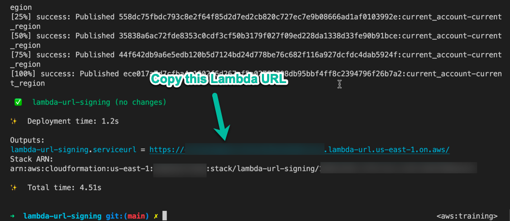
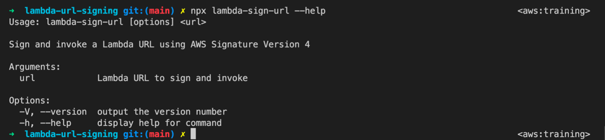
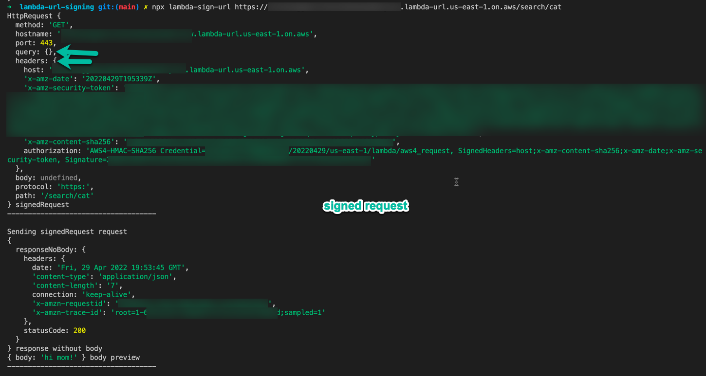
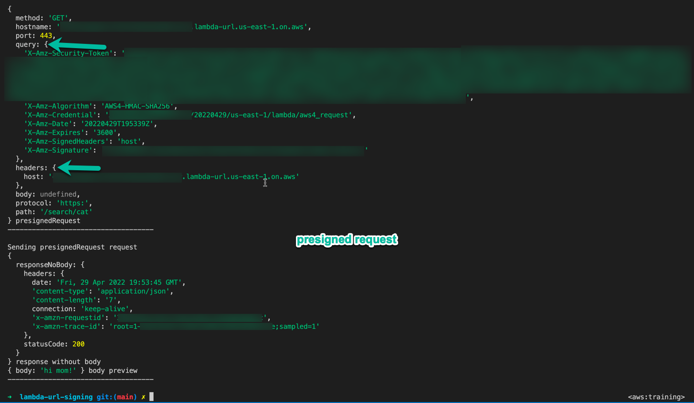

# Overview

Demonstrates how to sign an AWS Lambda URL request using Signature V4 and AWS-provided JavaScript / TypeScript / Node libraries:

- @aws-sdk/credential-provider-node
- @aws-sdk/signature-v4
- @aws-crypto/sha256-browser
- @aws-sdk/protocol-http
- @aws-sdk/node-http-handler

This signing method can also be used within a CloudFront @ Edge OriginRequest handler to sign requests to the origin then add the headers back into the request and allow CloudFront to forward it to the origin with auth.

# Usage

```
nvm use
npm i
npm run build

# To deploy to an AWS account
npx cdk deploy

# Copy the exported Lambda URL at the end of the deployment output
# Run the tool to send both the signed (headers) and presigned (query string) requests
# The URL will look like: https://[big-random-ish-string].lambda-url.[region].on.aws/
npx lambda-sign-url --service lambda|execute-api|[other] https://[your-url-value]/some/url
```

## CDK Deploy



## CLI Help



## Signed Request



## Presigned Request


